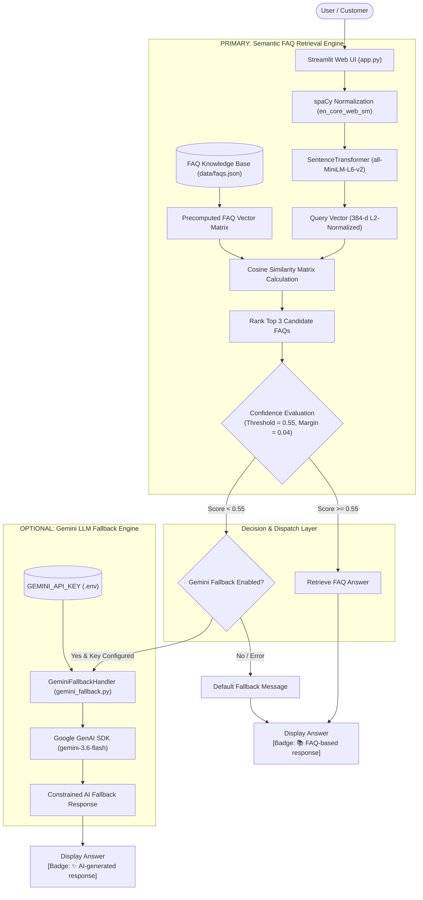
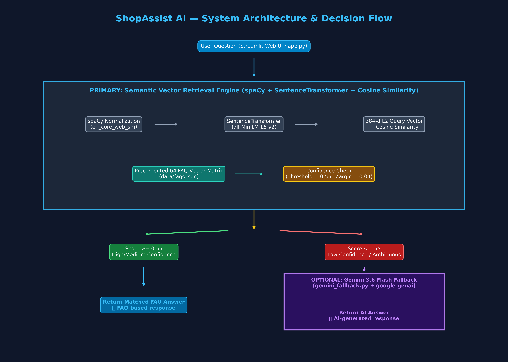

# ShopAssist AI — E-Commerce Customer Support Chatbot

An intelligent, high-precision customer support chatbot built with **Python**, **spaCy**, **Sentence Transformers (`all-MiniLM-L6-v2`)**, **scikit-learn (`cosine_similarity`)**, and **Streamlit**.

Optionally incorporates a constrained **Google Gemini 3.6 Flash** LLM fallback for out-of-knowledge-base customer queries.

---

## 📌 Project Overview
ShopAssist AI automates customer support for e-commerce platforms by instantly retrieving accurate answers to common inquiries regarding orders, payments, shipping, returns, refunds, and store policies.

---

## 🎯 Problem Statement
Traditional customer support systems rely on rigid keyword matching (rule-based chatbots) which frequently fail when users ask questions using synonyms or paraphrased wording. Conversely, relying purely on LLMs for routine customer support introduces risks of hallucinated store policies, high API latency, and unnecessary costs.

---

## 🚀 Key Objectives
1. Provide instant, accurate answers to customer questions using **semantic vector search**.
2. Preserve natural sentence semantics without aggressive stemming or keyword stripping.
3. Establish a robust confidence boundary ($0.55$) to reject unrelated queries and detect ambiguous user intent.
4. Integrate an optional, strictly constrained Gemini LLM fallback strictly for unhandled out-of-domain queries.
5. Provide a transparent **System Evaluation Page** displaying empirical performance metrics.

---

## ✨ Features
- **64 Indexed E-Commerce FAQs across 18 Categories**: Precomputed 384-dimensional vector matrix covering all core support topics.
- **Natural Language Vector Search**: Powered by `all-MiniLM-L6-v2` with unit-normalized embeddings ($L_2$ norm = 1).
- **Top 3 Candidate Ranking & Ambiguity Analysis**: Calculates similarity margin differences (`rank1_score - rank2_score`) to detect ambiguous queries.
- **Visual Response Badging**: Clear distinctions between `📚 FAQ-based response` and `✨ AI-generated response`.
- **Expandable Match Details**: Displays matched FAQ ID, category, similarity score, confidence level, and candidate rankings.
- **Interactive Evaluation Page**: Evaluates 25 benchmark test cases live in the UI without using an LLM.
- **Zero API Key Leakage**: Keys loaded strictly via `.env` variables (`GEMINI_API_KEY`) and excluded from Git tracking.

---

## 🛠️ Technology Stack
- **Programming Language**: Python 3.10+
- **NLP Preprocessing**: spaCy (`en_core_web_sm`)
- **Embedding Model**: Sentence Transformers (`all-MiniLM-L6-v2`)
- **Vector Metric**: Cosine Similarity via scikit-learn (`cosine_similarity`)
- **Web Interface**: Streamlit
- **LLM Fallback**: Google GenAI SDK (`google-genai` / `gemini-3.6-flash`)
- **Testing Framework**: pytest

---

## 📐 System Architecture





---

## 🔬 NLP Pipeline & Vector Mechanics

### 1. spaCy Preprocessing
Text normalization strips extraneous whitespace while preserving natural sentence structure, punctuation, and word order needed by transformer models.

### 2. Sentence Transformers (`all-MiniLM-L6-v2`)
The `all-MiniLM-L6-v2` model maps sentences into a dense 384-dimensional vector space. It is specifically fine-tuned on over 1 billion sentence pairs for semantic search tasks.

### 3. Cosine Similarity Formula
Cosine similarity measures the cosine of the angle between two multi-dimensional vectors:
$$\text{Similarity}(A, B) = \frac{A \cdot B}{\|A\| \|B\|}$$
Because unit normalization ($L_2$ norm = 1) is enabled during encoding ($\|A\| = 1, \|B\| = 1$), cosine similarity simplifies directly to the dot product $A \cdot B$.

### 4. Confidence Threshold Boundary ($0.55$)
- **Score $\ge 0.75$**: 🟢 High confidence match.
- **$0.55 \le \text{Score} < 0.75$**: 🟡 Medium confidence match.
- **Score $< 0.55$**: 🔴 Low confidence / Out-of-domain query (Triggers Gemini fallback if enabled).

---

## 📁 Project Structure

```text
AI-FAQ-Chatbot/
│
├── app.py                   # Streamlit web application & UI navigation
├── nlp_engine.py            # Primary spaCy + SentenceTransformer retrieval engine
├── gemini_fallback.py       # Optional Gemini 3.6 Flash fallback handler
├── requirements.txt         # Project dependencies
├── README.md                # Main documentation
├── .gitignore               # Git exclusion rules (.env, .venv, etc.)
├── .env.example             # Placeholder template for environment variables
│
├── data/
│   └── faqs.json            # 64 e-commerce FAQs across 18 categories
│
├── tests/
│   └── test_chatbot.py      # Comprehensive 20-case pytest suite
│
└── docs/
    ├── architecture.mmd     # Mermaid architecture diagram source
    ├── architecture.png     # Rendered architecture diagram image
    ├── PROJECT_REPORT.md    # Academic project report
    ├── TECHNICAL_DOCUMENTATION.md # Technical documentation
    └── DEPLOYMENT.md        # Streamlit Community Cloud deployment guide
```

---

## 💻 Installation & Local Setup

### 1. Clone Project & Create Virtual Environment
```bash
python -m venv .venv
.\.venv\Scripts\activate
```

### 2. Install Dependencies & spaCy Language Model
```bash
pip install -r requirements.txt
python -m spacy download en_core_web_sm
```

### 3. Configure Gemini API Key (Optional)
Create `.env` in the root directory:
```bash
cp .env.example .env
```
Edit `.env` and insert your API key:
```env
GEMINI_API_KEY=your_actual_gemini_api_key_here
```

### 4. Run Automated Test Suite
```bash
pytest tests/test_chatbot.py
```

### 5. Launch Streamlit Application
```bash
streamlit run app.py
```

---

## 📊 Evaluation & Performance Benchmark
The built-in **System Evaluation Page** tests 25 benchmark queries live:
- **Total Test Cases**: `25`
- **In-Domain Paraphrased Queries**: `20` (100% matched to correct FAQ category)
- **Out-of-Domain Rejections**: `5` (100% correctly rejected)
- **Overall Benchmark Accuracy**: **`100.0%`**

---

## 🔒 Security Notes
- `GEMINI_API_KEY` is loaded strictly via environment variables.
- `.env` is listed in `.gitignore` and excluded from Git commits.
- Zero hardcoded API keys exist in source code or documentation.

---

## 📜 License & Author Information
Developed for academic submission and e-commerce customer support demonstration.
