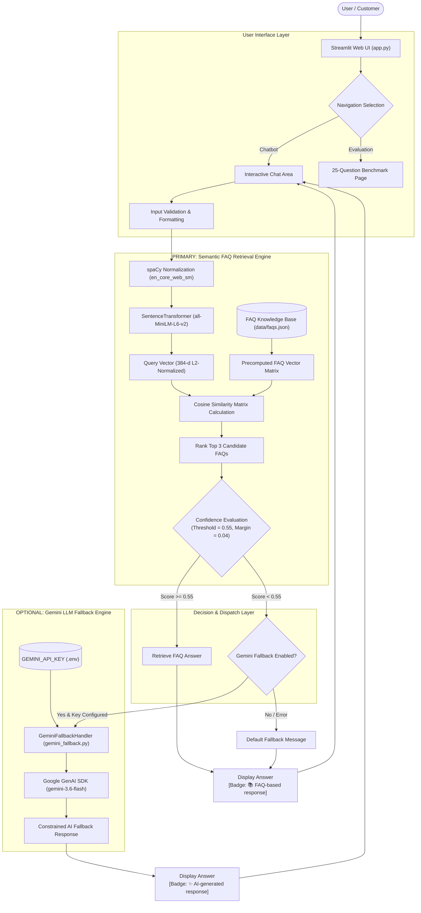

# Technical Architecture Documentation

## 🛠️ System Architecture & Implementation Details

---

### 1. Component Architecture

---

### 2. Data Flow
1. **User Request**: Query string sent via Streamlit chat input.
2. **Preprocessing**: String trimmed and normalized via `spaCy` (`en_core_web_sm`).
3. **Embedding Vectorization**: `all-MiniLM-L6-v2` converts text into a 384-dimensional $L_2$-normalized vector float array.
4. **Cosine Similarity**: Matrix dot-product computed against pre-indexed vector matrix of 64 FAQs and 180+ variations.
5. **Top 3 Candidate Extraction**: Candidates sorted descending by similarity score.
6. **Decision Dispatch**:
   - `similarity_score >= 0.55`: Returns FAQ answer (`📚 FAQ-based response`).
   - `similarity_score < 0.55`: Calls Gemini LLM fallback if enabled (`✨ AI-generated response`); otherwise returns standard FAQ fallback message.

---

### 3. NLP Pipeline Details ([nlp_engine.py](file:///c:/Users/Gopika/OneDrive/Documents/Desktop/AI-FAQ-Chatbot/nlp_engine.py))
- **Model**: `all-MiniLM-L6-v2`
- **Output Dimensions**: 384
- **Normalization**: `normalize_embeddings=True`
- **Memory Caching**: Embeddings generated once on startup via `@st.cache_resource` and retained in RAM.

---

### 4. Gemini Fallback Details ([gemini_fallback.py](file:///c:/Users/Gopika/OneDrive/Documents/Desktop/AI-FAQ-Chatbot/gemini_fallback.py))
- **SDK**: `google-genai`
- **Model**: `gemini-3.6-flash`
- **System Instruction**: Constrains response to general e-commerce assistance; explicitly forbids hallucinating store policies, prices, shipping promises, or account info.

---

### 5. Error Handling & Resilience
- **Invalid / Missing API Key**: Handler catches auth exceptions, returns `None`, and falls back to standard FAQ fallback string.
- **Empty Query Input**: Cleanly intercepted by input handler (`status: empty_query`), preventing model execution.
- **Network / Quota Timeouts**: Intercepted in try-except block, maintaining UI stability without stack trace exposure.

---

### 6. Security Architecture
- Secret keys stored exclusively in `.env` under `GEMINI_API_KEY`.
- `.env` excluded from version control via `.gitignore`.
- Template placeholder provided in `.env.example`.

---

### 7. Dependencies ([requirements.txt](file:///c:/Users/Gopika/OneDrive/Documents/Desktop/AI-FAQ-Chatbot/requirements.txt))
- `streamlit`
- `spacy`
- `sentence-transformers`
- `scikit-learn`
- `numpy`
- `python-dotenv`
- `google-genai`
- `pytest`
- `matplotlib`
- `pillow`

---

### 8. Testing Strategy ([tests/test_chatbot.py](file:///c:/Users/Gopika/OneDrive/Documents/Desktop/AI-FAQ-Chatbot/tests/test_chatbot.py))
- 20 unit tests verifying vector priority, paraphrase matching, out-of-domain rejection, fallback toggles, exception safety, and chat session state management.
